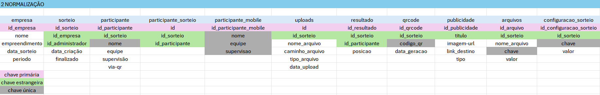

# CRIAÇÃO DO BANCO DE DADOS DA ROLETA – P.I

# Contexto

• Para o nosso Projeto Integrador, cujo o tema trata-se de uma roleta  para ser usada em estabelecimentos, foi criado um banco de dados chamado (roletadb;).

• Logo em seguida, para a estrutura do banco de dados da roleta, foi pensado e definido algumas das identidades principais, sendo elas;
1. Empresa
2. Participante
3. Participante Mobile
4. Participante sorteio
5. Sorteio
6. Resultado
7. Uploads
8. QRCode
9. Publicidade - Para anúncios que serão exibidos no site.
10. Arquivos
11. Configuração do sorteio - Caso haja alguma alteração da roleta.
12.	Caso haja necessidade – Configurações do Sorteio (para futuras personalizações e novas animações) essa entidade ajuda.


# Modelo Conceitual
Definição das entidades do banco de dados.


## MODELAGEM BANCO DE DADOS

A modelagem do banco de dados foi feita à partir da definição das entidades, pensando nisso, foi realizado o modelo lógico juntamente com as normalizações, sendo eles todos os atributos necessários para o banco de dados.

# Especificação dos elementos usados no banco de dados.

• Tabelas:

▪ Empresa ▪ empresa_id (Chave Primária) ▪ nome ▪ empreendimento ▪ data_sorteio ▪ periodo. 

▪ Sorteio ▪ sorteio_id ▪ (Chave Primária) ▪ empresa_id ▪ administrador_id (Chaves Estrangeiras referenciando as tabelas empresa e administrador) ▪ data da criação ▪ finalizado.

▪ Participante ▪ participante_id ▪ (Chave Primária) ▪ sorteio_id (Chave Estrangeira referenciando a tabela sorteio) ▪ nome ▪ equipe ▪ Supervisão ▪ via_qr.

▪ Participante Mobile ▪ id_participante_mobile (Chave Primária)  ▪ nome  ▪ equipe  ▪ supervisao.

▪ Participante Sorteio  ▪ id  ▪ sorteio_id  ▪ participante-id.

▪ Uploads ▪ id int auto_increment primary key  ▪ sorteio_id ▪ nome_arquivo  ▪ caminho_arquivo  ▪ tipo_arquivo  ▪ data_upload  ▪ (Chave Estrangeira) foreign key(id_sorteio) references sorteio(id).

▪ Resultado ▪ resultado-id ▪ (Chave Primária) ▪ sorteio_id ▪ participante-id ▪ (Chave Estrangeira referenciando as tabelas sorteio e participante) ▪ posicao. 

▪ QRCode ▪ qr-id ▪ (Chave Primária) ▪ sorteio-id (Chave Estrangeira referenciando a tabela sorteio) ▪ codigo_qr ▪ data_geracao.

▪ Publicidade ▪ publicidade_id ▪ (Chave Primária) ▪ titulo ▪ imagem_url ▪link_destino ▪ tipo.

▪ Arquivos ▪ arquivos-id ▪ (Chave Primária) ▪ sorteio-id (Chave Estrangeira referenciando a tabela sorteio) ▪ nome-arquivo ▪ data_geracao.


▪ Configuracoes sorteio ▪ configuracoes_sorteio-id ▪ (Chave Primária) ▪ sorteio-id (Chave Estrangeira referenciando a tabela sorteio) ▪ chave ▪ valor.


# Modelo Lógico com as normalizações


## 1 Normalização


## 2 Normalização


## 3 Normalização


## 3 Normalização


 ## 3 Normalização


# MODELO FISICO - Banco de dados
### Código escrito em sql

```sql create database roletadb; use roletadb;
-- criação do banco de dados
create database roletadb;

-- seleciona o banco de dados
use roletadb;

-- tabela de empresas
create table empresa (
    id_empresa int auto_increment primary key,
    nome varchar(255) not null,
    empreendimento varchar(255) not null,
    data_sorteio date not null,
    periodo enum('manhã', 'tarde', 'integral') not null
);

-- tabela de sorteios
create table sorteio (
    id int auto_increment primary key,
    id_empresa int not null,
    nome_responsavel varchar(255) not null,
    email_responsavel varchar(255) unique not null,
    senha_responsavel varchar(255) not null,
    data_criacao datetime default current_timestamp,
    status enum('aberto', 'finalizado') default 'aberto',
    finalizado boolean default false
);

-- tabela de participante
create table participante (
    id_participante int auto_increment primary key,
    nome varchar(255) not null,
    equipe varchar(255) not null,
    supervisao varchar(255),
    id_sorteio int not null,
    via_qr boolean default false,
    unique(id_sorteio, nome)
);

CREATE TABLE participante_sorteio(
    id int auto_increment primary key,
    id_sorteio int not null,
    id_participante int not null
);

create table participante_mobile(
    id_participante_mobile int auto_increment primary key,
    nome varchar(255) not null,
    equipe varchar(255) not null,
    supervisao varchar(255) unique not null
);

create table uploads(
     id int auto_increment primary key,           -- Identificador único para o upload
     id_sorteio int,                              -- Relacionamento com o sorteio, ou outra tabela relevante
     nome_arquivo varchar(255) not null,          -- Nome do arquivo
     caminho_arquivo varchar(255) not null,        -- Caminho onde o arquivo foi armazenado no servidor
     tipo_arquivo varchar(50),                    -- Tipo do arquivo (ex: PDF, CSV, XLSX, etc.)
     data_upload timestamp default current_timestamp,  -- Data e hora do upload
     foreign key(id_sorteio) references sorteio(id)  -- Caso haja uma tabela de sorteios, você pode referenciar aqui
 );

-- tabela de resultados
create table resultado (
    id_resultado int auto_increment primary key,
    id_sorteio int not null,
    id_participante int not null,
    posicao int not null
);

-- tabela de qrcodes
create table qrcode (
    id_qrcode int auto_increment primary key,
    id_sorteio int not null,
    codigo varchar(255) unique not null,
    data_geracao datetime default current_timestamp
);

-- tabela de publicidade
create table publicidade (
    id_publicidade int auto_increment primary key,
    titulo varchar(255) not null,
    imagem_url varchar(255) not null,
    link_destino varchar(255) not null,
    tipo enum('rodapé', 'qr_intermediário', 'qr-final') not null
);

-- tabela de arquivos gerados
create table arquivos (
    id_arquivos int auto_increment primary key,
    id_sorteio int not null,
    nome_arquivo varchar(255) not null,
    data_geracao timestamp default current_timestamp
);

-- tabela de configurações do sorteio
create table configuracoes_sorteio (
    id_configuracoes_sorteio int auto_increment primary key,
    id_sorteio int not null,
    chave varchar(255) not null,
    valor varchar(255) not null
);


-- adicionando chaves estrangeiras separadamente
alter table sorteio
    add foreign key (id_empresa) references empresa(id_empresa) on delete cascade;

alter table participante
    add foreign key (id_sorteio) references sorteio(id) on delete cascade;

alter table participante_sorteio
    add foreign key (id_sorteio) references sorteio(id) on delete cascade,
    add foreign key (id_participante) references participante_mobile(id_participante_mobile) on delete cascade;

alter table resultado
    add foreign key (id_sorteio) references sorteio(id) on delete cascade,
    add foreign key (id_participante) references participante(id_participante) on delete cascade;

alter table qrcode
    add foreign key (id_sorteio) references sorteio(id) on delete cascade;

alter table arquivos
    add foreign key (id_sorteio) references sorteio(id) on delete cascade;

alter table uploads
    add foreign key (id_sorteio) references sorteio(id) on delete cascade;

alter table configuracoes_sorteio
    add foreign key (id_sorteio) references sorteio(id) on delete cascade;


alter table sorteio
    add column id_empresa int not null;


-- alter table qrcode
-- change column id_qr id_qrcode int;
```

## Modelo de Entidade Relacional

#### Diagrama do relacionamento - ROLETA


